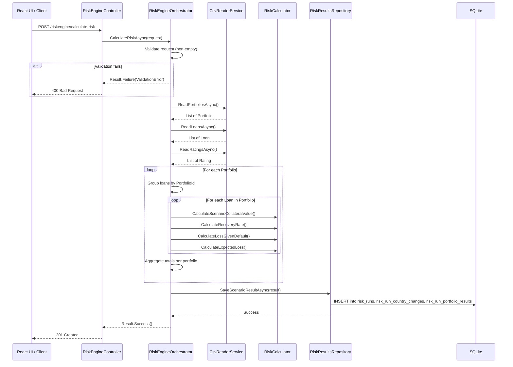

# Portfolio Risk Engine

A scenario-based portfolio risk calculation engine that models the impact of house price changes across multiple countries on loan portfolios. Users define percentage changes per country, and the engine computes expected losses by applying those scenarios against loan-level collateral data, credit ratings, and probability-of-default mappings.

---

## Prerequisites

### Backend (.NET API)

- [.NET 10 SDK](https://dotnet.microsoft.com/download/dotnet/10.0)
- No database setup required — SQLite is fully embedded and the database file is created automatically on first write.

### Frontend (React UI)

- [Node.js](https://nodejs.org/) (v20+ recommended)
- npm (included with Node.js)

### Running the Application

**Start the API:**

```bash
cd PortfolioRiskEngine/PortfolioRiskEngine.Api
dotnet run --launch-profile http
```

The API starts on `http://localhost:5118`. Swagger UI is available at `http://localhost:5118/swagger`.

**Start the React UI:**

```bash
cd PortfolioRiskEngine.ReactUI/PortfolioRiskEngine.ReactUI
npm install
npm run dev
```

The UI starts on `http://localhost:5173`.

---

## Architecture Overview



---

## Solution Structure

### Backend — Clean Architecture

```
PortfolioRiskEngine/
├── PortfolioRiskEngine.Api/             # Presentation layer
│   ├── Controllers/
│   │   ├── RiskEngineController.cs      # POST /riskengine/calculate-risk
│   │   └── RunsSearchController.cs      # GET  /RunsSearch/search-runs
│   └── Program.cs                       # DI composition root, middleware, CORS
│
├── PortfolioRiskEngine.Application/     # Application layer
│   ├── DTOs/                            # Data transfer objects
│   ├── Interfaces/                      # ICsvReaderService, IRiskResultRepository
│   ├── Orchestrators/                   # RiskEngineOrchestrator, SearchRunsOrchestrator
│   └── Results/                         # Result pattern (Result<T>, Error types)
│
├── PortfolioRiskEngine.Domain/          # Domain layer
│   ├── Entities/                        # Loan, Portfolio, Rating (records)
│   └── Services/                        # RiskCalculator (pure calculation logic)
│
├── PortfolioRiskEngine.Infrastructure/  # Infrastructure layer
│   ├── Data/                            # CSV files (loans, portfolios, ratings) + SQLite DB
│   ├── Helpers/                         # SQL query constants
│   └── Services/                        # CsvReaderService, RiskResultsRepository
│
└── Tests/
    ├── PortfolioRiskEngine.Api.Tests/
    ├── PortfolioRiskEngine.Application.Tests/
    ├── PortfolioRiskEngine.Domain.Tests/
    ├── PortfolioRiskEngine.Infrastructure.Tests/
    └── PortfolioRiskEngine.IntegrationTests/
```

### React UI

```
PortfolioRiskEngine.ReactUI/src/
├── clients/              # API client (RiskEngineClient.ts)
├── models/               # TypeScript interfaces matching backend DTOs
├── pages/                # Page components (HomePage, RunHistoryPage)
│   └── __tests__/        # Jest component tests
├── App.tsx               # App shell with tab navigation
└── main.tsx              # Entry point
```

---

## Technology Choices

### Why React (TypeScript + SWC)

I chose React because I wanted separation of concerns between the frontend and the backend. With a standalone React SPA, the .NET API and the frontend can be developed, deployed, and scaled independently — something that isn't possible with Razor Pages where the UI is tightly coupled to the server. As the expectations are to have a production-like architecture, this separation is needed.

I paired React with **TypeScript** instead of JavaScript because TypeScript provides static type checking, which helps detect errors during development and improves code reliability and maintainability. The TypeScript interfaces in the `models/` directory mirror the backend DTOs, creating a clear contract between frontend and backend.

**SWC (Speedy Web Compiler)** is a modern Rust-based compiler that replaces Babel for significantly faster builds and hot-reloads during development, keeping the feedback loop tight.

### Why SQLite

SQLite is a good option for this project for several reasons:

- **Cross-platform** — runs on Windows, Linux, and macOS without any additional setup.
- **No server process** — no database server to install, configure, or manage.
- **Fully embedded** — runs inside the application process via Dapper as a lightweight ORM.
- **Lightweight** — the entire database is stored in a single file (`risk-results.db`), making it easy to inspect, back up, or reset.

---

## Testing

### Unit Tests (xUnit + Shouldly)

Each backend layer has its own test project following the same Clean Architecture boundaries:

| Test Project | What It Tests |
|---|---|
| `PortfolioRiskEngine.Api.Tests` | Controller behaviour, HTTP status codes |
| `PortfolioRiskEngine.Application.Tests` | Orchestrator logic, validation, result patterns |
| `PortfolioRiskEngine.Domain.Tests` | Pure risk calculation functions |
| `PortfolioRiskEngine.Infrastructure.Tests` | CSV parsing, repository operations |

```bash
cd PortfolioRiskEngine
dotnet test
```

### Integration Tests (xUnit + WebApplicationFactory)

Located in `Tests/PortfolioRiskEngine.IntegrationTests/`, these tests spin up the full ASP.NET pipeline in-process using `WebApplicationFactory<Program>` and hit the real endpoints with a temporary SQLite database per test.

**Why WebApplicationFactory over WireMock:** WireMock is useful when you want to stub external HTTP dependencies, but this project's critical path is the internal pipeline — CSV loading, risk calculation, SQLite persistence, and the controller response mapping. `WebApplicationFactory` exercises the real application logic end-to-end within the test process, giving thorough coverage of the actual DI wiring, middleware, and error handling without needing a running server. Each test gets an isolated temporary database via `TemporarySqliteDatabase`, ensuring tests are independent and repeatable.

```bash
cd PortfolioRiskEngine
dotnet test --filter "FullyQualifiedName~IntegrationTests"
```

### Component Tests — React UI (Jest + React Testing Library)

Located in `src/pages/__tests__/`, these test the React components in isolation with the API client mocked out:

- **HomePage.test.tsx** — form rendering, input validation, success/error messages, loading states, reset behaviour
- **RunHistoryPage.test.tsx** — data fetching, loading/empty/error states, run card expand/collapse, pagination

```bash
cd PortfolioRiskEngine.ReactUI/PortfolioRiskEngine.ReactUI
npm test
```

### E2E API Tests (Playwright)

Located in the `e2e/` directory at the workspace root, these tests hit the live API endpoints covering both happy and sad paths:

- **calculate-risk.spec.ts** — valid scenarios (1, 2, and 6 countries) return 201; empty changes, missing body, and invalid JSON return 400
- **search-runs.spec.ts** — paginated queries return 200 with correct structure; invalid pagination (pageNumber=0, pageSize>100) returns 400

The Playwright config includes a `webServer` option that will auto-start the API if it is not already running.

```bash
cd e2e
npx playwright test
```
